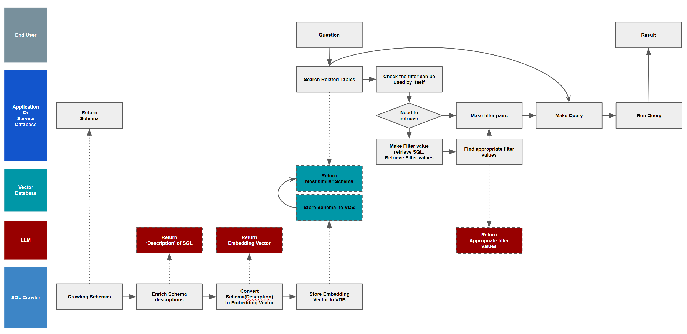
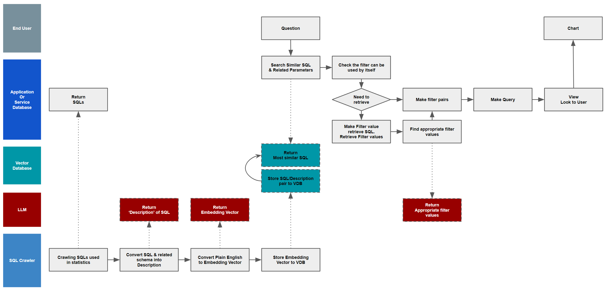
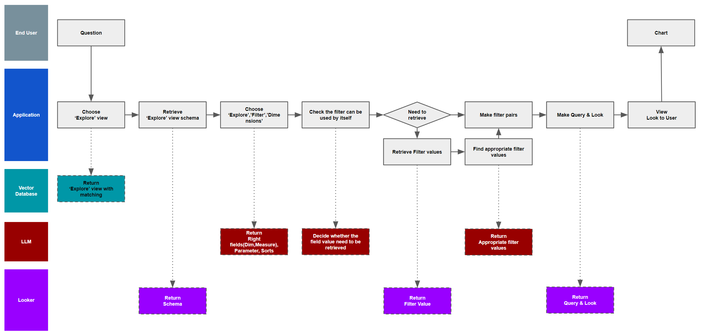

# NL to SQL.

In the era of AI, natural language has become the preferred way for many users to interact with data. While DW vendors have long touted "easy-to-use" natural language interfaces, their efforts have largely fallen short.

However, the advent of modern Large Language Models (LLMs) offers a promising new avenue for achieving true natural language to SQL conversion. This paper proposes and compares four distinct architectures for tackling this challenge:

1. Direct Conversion: This approach translates natural language queries directly into SQL statements.
2. SQL to Natural Language & Search Similar SQL: This architecture first translates already-known SQLs into the natural language(intent), then searches for similar existing SQL queries.
3. BI Dashboard Search (with Looker dashboard): This approach leverages existing BI dashboards and their description to understand the user's intent and find similar dashboard on Looker.
4. NL to SQL Conversion via Semantic Layer (with Looker Semantic Layer): This architecture utilizes Looker's Semantic Layer to create a semantic representation of the data model, which facilitates accurate natural language to SQL conversion.

While each architecture exhibits similar strengths and weaknesses, the Looker Semantic Layer offers unique capabilities that address many of the common challenges encountered in NL to SQL conversions. This paper provides a comprehensive analysis of these architectures and their respective advantages and limitations.


## 1. Direct Conversion

Direct Conversion is very efficient to convert NL to simple SQL - The important point here is that it is SQL that is simple, not a natural language query that is simple.

What's the difference ?

For example, (Case #1)

"I want to see average salary in the 'construction' industry" - It's very simple natural language query. It's matching SQL might be the following. 

``` SQL
  select average(salray) from salary_table where industry = 'construction' and year = '2023'
```

But, (Case #2)

"I want to see average salary YoY trends in 3 years." - It's also very simple request. but it's matching SQL is very different. 

```SQL
  select average_salary / lag(1, average_salary) over (partition by registration_year order by registration_year asc) as salary_yoy 
    from (select registration_year, average(salary) from salary_table where registration_year between '2020' and '2023') 
  limit 3
```

It's very complex SQL. 

Direct conversion is ideal for simple cases (e.g., case #1). However, while providing additional instructions and guide prompts can assist the LLM in constructing more complex SQL queries, this approach often suffers from insufficient conversion accuracy and effectiveness across a broader range of cases.

The overall architecture is outlined below.



[Implementation Example.](nl_to_sql1.ipynb)


## 2. SQL to Natural Language & Search similar SQL

Many companies already possess valuable analytic resources like pre-configured SQL queries. Even BI dashboards often generate and store the same SQL queries. Marketing teams also frequently utilize pre-defined segmentation rules, easily modified by changing filter values. The SQL to NL & Search approach shines in these scenarios, particularly for highly complex and static pre-defined SQL queries.

For example,

Question : "What are the five brands that are positioned as high-end in the swimwear and sportswear category ?"

```SQL
  with average_price_per_category as (
    select category, average(retail_price) as average_price from products
    group by category
  ),
  average_price_per_category_brand as (
    select category, brand, average(retail_prince) as average_price from products
    group by category, brand
  ),
  select a.average_price / b.average_price as price_ratio, brand
    from average_price_per_category_brand a join average_price_per_category b on (a.category = b.cartegory)
  where category in ('Swim', 'Suits & Sport Coats')
  order by 1 desc 
  limit 5

```

In this case, providing clear guidelines to the LLM through prompts can be quite challenging.
Instead of generating SQL, this approach focuses on selecting the most appropriate pre-defined query from the assets stored in the vector database and utilizing it directly.

The overall architecture closely resembles the direct conversion approach, but with the key difference of crawling the actual SQL code, including schema information.



[Implementation Example.](nl_to_sql2.ipynb)


## 3. NL to Looker Dashboard

Looker Dashboard can show business reports in one page. 

Dashboard can describe its own business goal. 

This architecture is very similar with type #2. Sql to NL & search. 


## 4. NL to Looker View

As you know LLM can leverage its capabilities with some hardened framework. (For example, LLMMath chain)

Looker Query Maker is a kind of solution for this. 

Looker can solve the following issues during converting NL to SQL.

1. Business context suggestion
  : Looker 'Explore' can expose the relationships between related tables. 

2. Filter value adjustment
  : Looker 'Filter' can solve various filter values and operators. 

3. Complex Query generation
  : Looker 'Dimension/Measure' attributes can solve complex SQL generation.

If we could choice 'wanted' columns, Looker can make complex SQL via selected dimensions and Measures. 
It's a very great feature for LLM to make SQL easily. 


[Implementation Example.](lookml_explorer.ipynb)